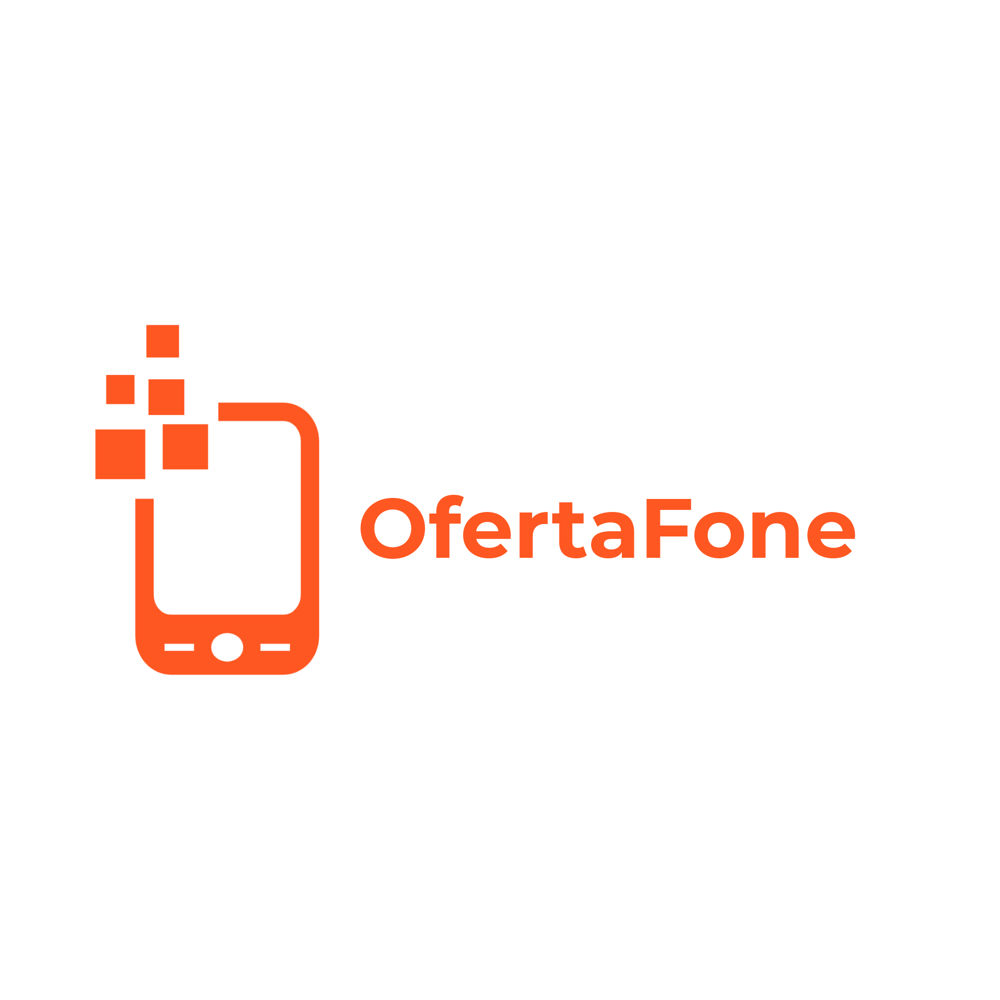

# OfertaFone

#### PONTIFÍCIA UNIVERSIDADE CATÓLICA DE MINAS GERAIS

`TECNOLOGIA EM ANÁLISE E DESENVOLVIMENTO DE SISTEMAS`

`Projeto: Desenvolvimento de uma Aplicação Interativa`

`2º semestre de 2022`

O objetivo deste projeto é criar uma plataforma de revenda de dispositivos eletrônicos, visando a redução de e-lixo por meio do aproveitamento máximo de sua usabilidade, bem como o cuidado da saúde humana e do meio ambiente, e rentabilidade advinda da venda destes produtos.

O lançamento de novos modelos de telefones e tablets têm levado as pessoas a trocar seus aparelhos ainda em condições satisfatórias de uso. Isso acarreta na geração de lixo eletrônico, que se não for descartado adequadamente, trará danos ao meio ambiente. Utilizar um aparelho até o fim de sua vida útil ainda é a melhor forma de economizar recursos naturais, pois se evita a fabricação de um novo aparelho que iria atender a esta demanda. Além disso, atinge-se um público que não teria acesso a aparelhos novos, pelo seu custo elevado, ou para aqueles que desejam apenas economizar ao adquirir um aparelho usado.

## Integrantes

* José Vicente do Vale Melo
* Karen Franco Alavarque Escobedo
* Luiz Carlos Gil de Souza
* Pedro Vitor Rodrigues da Silva
* Ursula Daniela Figueiredo Barbosa

## Orientador

* Rosilane Ribeiro da Mota

## Estamos Online

Veja o projeto em execução na instância oficial do <a href="https://ofertafonenaweb.azurewebsites.net/" target="_blank">OfertaFone</a>.

* usuário - admin
* senha - admin@123

# Documentação

<ol>
<li><a href="docs/01-Documentação de Contexto.md"> Documentação de Contexto</a></li>
<li><a href="docs/02-Especificação do Projeto.md"> Especificação do Projeto</a></li>
<li><a href="docs/03-Metodologia.md"> Metodologia</a></li>
<li><a href="docs/04-Projeto de Interface.md"> Projeto de Interface</a></li>
<li><a href="docs/05-Arquitetura da Solução.md"> Arquitetura da Solução</a></li>
<li><a href="docs/06-Template Padrão da Aplicação.md"> Template Padrão da Aplicação</a></li>
<li><a href="docs/07-Programação de Funcionalidades.md"> Programação de Funcionalidades</a></li>
<li><a href="docs/08-Plano de Testes de Software.md"> Plano de Testes de Software</a></li>
<li><a href="docs/09-Registro de Testes de Software.md"> Registro de Testes de Software</a></li>
<li><a href="docs/10-Relatório de Testes de Software.md"> Relatório de Testes de Software</a></li>
<li><a href="docs/11-Plano de Testes de Usabilidade.md"> Plano de Testes de Usabilidade</a></li>
<li><a href="docs/12-Registro de Testes de Usabilidade .md"> Registro de Testes de Usabilidade</a></li>
<li><a href="docs/13-Relatório de Testes de Usabilidade.md"> Relatório de Testes de Usabilidade</a></li>
<li><a href="docs/14-Apresentação do Projeto.md"> Apresentação do Projeto</a></li>
<li><a href="docs/15-Referências.md"> Referências</a></li>
</ol>

# Código

<li><a href="src/README.md"> Código Fonte</a></li>

# Apresentação

<li><a href="presentation/README.md"> Apresentação da solução</a></li>
