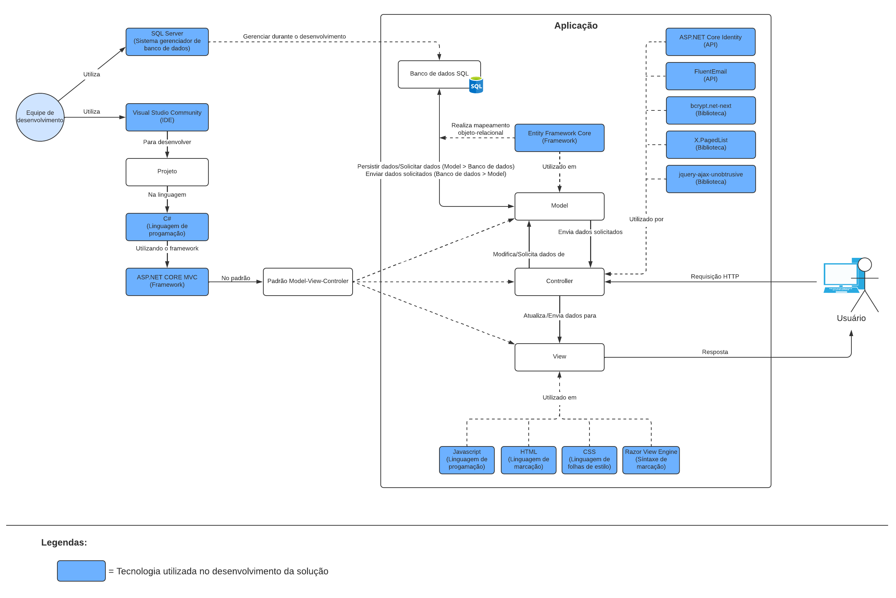
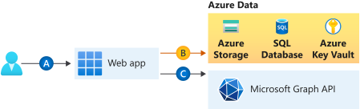

# Arquitetura da Solução

## Diagrama de Classes

O diagrama de classes ilustra graficamente como será a estrutura do software, e como cada uma das classes da sua estrutura estarão interligadas. Essas classes servem de modelo para materializar os objetos que executarão na memória.

##### *Figura 6.  Diagrama de classes*

## Modelo ER (Projeto Conceitual)

O Modelo ER representa através de um diagrama como as entidades (coisas, objetos) se relacionam entre si na aplicação interativa.

##### *Figura 7. Modelo Entidade Relacionamento (MER)*

## Projeto da Base de Dados

O projeto da base de dados corresponde à representação das entidades e relacionamentos identificadas no Modelo ER, no formato de tabelas, com colunas e chaves primárias/estrangeiras necessárias para representar corretamente as restrições de integridade.

##### *Figura 8. Diagrama Entidade Relacionamento (DER)*

## Tecnologias Utilizadas

Linguagens de progamação utilizadas:

- C#: Linguagem de progamação utilizada para desenvolvimento do backend da solução.
- Javascript: Linguagem de progamação utilizada no frontend para a implementação de certas funcionalidades.

Frameworks utilizados:

- ASP.NET Core MVC: Framework implementando o padrão Model-View-Controller, será utilizado como base para desenvolvimento da solução.
- Entity Framework Core: Framework de mapeamento objeto-relacional (técnica utilizada para resolver o problema da impedância entre o modelo orientado a objetos e o modelo relacional) para a plataforma .NET, será utilizado para facilitar a manipulação e consulta do banco de dados relacional utilizado aplicação.

Bibliotecas utilizadas:

- X.PagedList: Biblioteca que adiciona suporte a paginação. Permite converter IQueryables/IEnumerables para "PagedLists" nos controllers, que podem ser passadas para as views de forma a mostrar apenas o conteúdo presente na página atualmente selecionada;
- jquery-ajax-unobtrusive: Biblioteca que permite adicionar atributos "data-" customizados ao HTML que permitem adicionar funções AJAX do JQuery a eles. É utilizada neste projeto para a realização de updates parciais nas páginas, sem necessitar recarregar a página inteira para alterar um único elemento (por exemplo, para atualizar o número presente no contador de novas mensagens sem precisar recarregar a página inteira).

APIs utilizadas:

- ASP.NET Core Identity: API que dá suporte a funcionalidade de login da interface do usuário. Será utilizado para implementar a função de login e autenticação do usuário, além da separação das contas por tipos de usuários.
- FluentEmail: API do .NET Core que permite o envio de emails dentro da aplicação;

IDE utilizada: Visual Studio Community 2022, escolhido pela integração com o Framework ASP.NET e outras ferramentas utilizadas no projeto como o SQL Server.

Sistema gerenciador de banco de dados: SQL Server, escolhido por sua boa integração com o editor de código e para facilitar a migração do banco de dados para o serviço de hospedagem nas fases mais avançadas do projeto.

Outras tecnologias:

- HTML: Linguagem de marcação utilizada para a construção das páginas web.
- CSS: Linguagem de folhas de estilos utilizada para aplicar estilos nos elementos HTML.
- Razor: Sintaxe de marcação que permite inserir código baseado em .NET em páginas web junto ao HTML.

A figura abaixo demonstra como as tecnologias empregadas se relacionam dentro do sistema e como ocorre a interação do usuário com o sistema até que ele retorne uma resposta ao usuário.

<b>Figura 8</b> - Tecnologias empregadas no sistema e retorno de resposta do sistema mediante requisição feita pelo usuário

 

## Hospedagem

